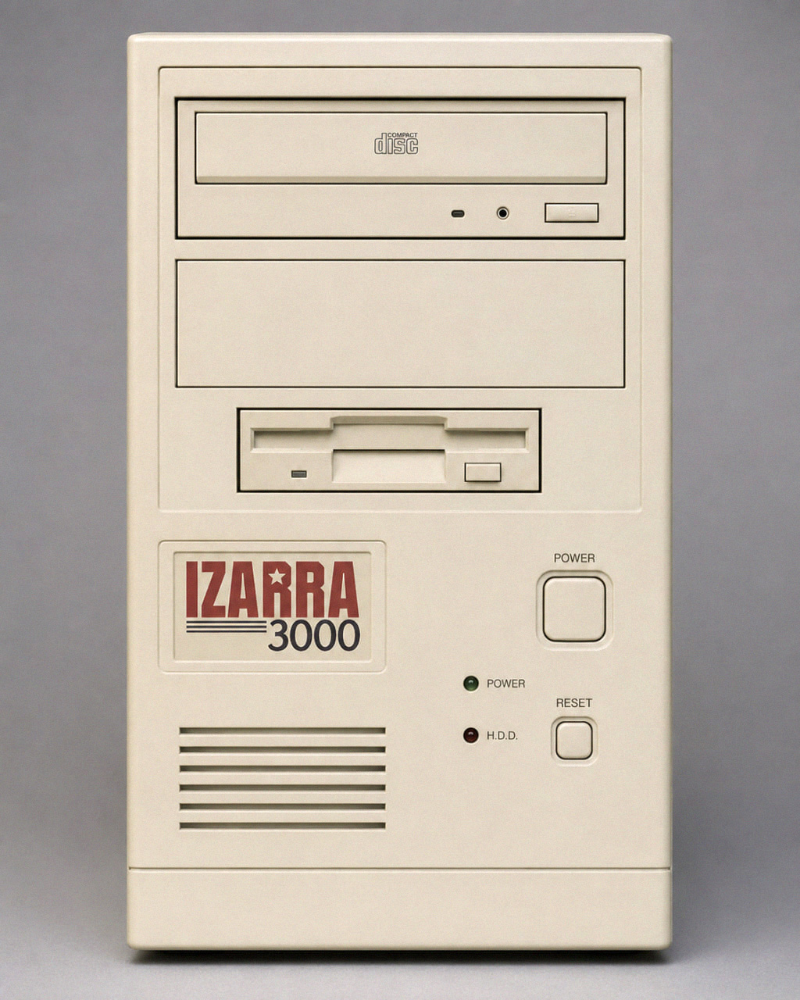

#  IzarraVM

IzarraVM is a Rust emulator for the Izarra 3000, a DOS-era games computer that
almost shipped in 1997. It models one fixed machine: custom video and audio
around an MS-DOS compatible core, with Toka Disk System as its ROM shell and
launcher.

<p align="center">
  
</p>

The goal is to run early to mid 1990s DOS games as if the Izarra had reached
store shelves. Some games already run, but the VM is far for complete, and performance
is lacking in a few areas, most importantly on the CPU. The 486 Mode @66 MHz is borderline,
and the full speed mode is not yet usable.

## Origin

Izarra Computer Systems started in 1987 as a small Spanish workstation shop that
built graphics terminals for schools and local studios. Its engineers wanted a
home computer that could run DOS games without feeling like a beige PC, and they
spent the next decade chasing that idea across three machines.

The Izarra 1000 arrived in 1990 around a 286 at 12 MHz, followed in 1993 by the
386-based Izarra 2000 at 25 MHz. Both sold modestly to the schools and studios
that already knew the brand. Work on the 3000 began in late 1994 as the most
ambitious of the three: a tight motherboard around VGA, MIDI, CD-ROM audio, and
a friendly ROM shell, fast enough to make DOS games feel at home.

The prototype was fast, but the timing was brutal. Windows 95 made compatibility
the only spec retailers cared about, so Izarra kept adding bridge chips and
fallback modes to reassure publishers. The board became expensive and late. In
April 1997, with the first production run still in testing and suppliers asking
for cash, the company filed for bankruptcy. IzarraVM is what survived in the lab
notes.

## Tech Specs

The emulator targets one fixed machine. None of this is user-selectable; it
reproduces the Izarra 3000 exactly as it was built.

| Area | Izarra 3000 hardware |
| --- | --- |
| CPU | GSW-586, a K6-class 266 MHz part on a 66 MHz bus. Toka can throttle it to 486DX2 66 MHz or 386DX 25 MHz without rebooting. |
| Memory | 24 MB SDRAM, with Toka mapping itself out of conventional memory when DOS games need the first 640 KB. |
| Graphics | VEGA chipset: Margo 2D, Distira 3D, 4 MB video memory, VESA VBE 2.0, VGA mode 13h, and up to 1024x768 at 32-bit color. |
| Sound | ReSonique 2: Sound Blaster 16 compatible digital audio, OPL3 FM, MPU-401 MIDI, wavetable daughterboard, and Yamaha ADPCM-B playback. |
| Storage | 3.6 GB IDE hard disk, 12x ATAPI CD-ROM with CD audio, and a 1.44 MB floppy drive. |
| Display | 15-inch CRT, tuned for 320x200 DOS modes and 1024x768 desktop output. |
| Firmware | 2 MB ROM with the Izarra BIOS, Toka Disk System, ICOMMAND, and bundled tools. |
| I/O | PS/2 keyboard and mouse, serial, parallel, VGA, line out, line in, and MIDI/game port. |

## Current State

IzarraVM is early. The emulator boots its own BIOS and Toka-DOS path, and some
simple DOS software may work, but it is not a dependable DOS game runner yet.

## Quick Start

```powershell
cargo run -p izarravm -- --headless-config-check
cargo run -p izarravm -- --headless-test-rom
cargo run -p izarravm -- --headless-boot-suite
cargo run -p izarravm -- --config examples/izarravm.toml
```

For non-Windows hosts later, replace the `c_drive` path in
`examples/izarravm.toml` or pass `--c-drive /path/to/dosroot`.

By default the C: drive, `cmos.bin`, and `izarravm.conf` live under the per-user
`~/.izarravm` directory, so launching the binary from any folder leaves nothing
behind in the working directory. Pass `--portable` to keep them in a `c_drive`
beside the executable instead, for a self-contained install.

## Validation

```powershell
cargo fmt --check
cargo clippy --workspace --all-targets -- -D warnings
cargo test --workspace
cargo build --workspace
```

## License

GNU GPL v3.0 only (see [LICENSE](LICENSE)). The subsystems are clean-room
reimplementations built from primary hardware/OS documentation; reference
implementations (e.g. FreeDOS for the DOS layer, Nuked-OPL3 for audio) are used
only as behavioral oracles to check assumptions, never copied or translated.
