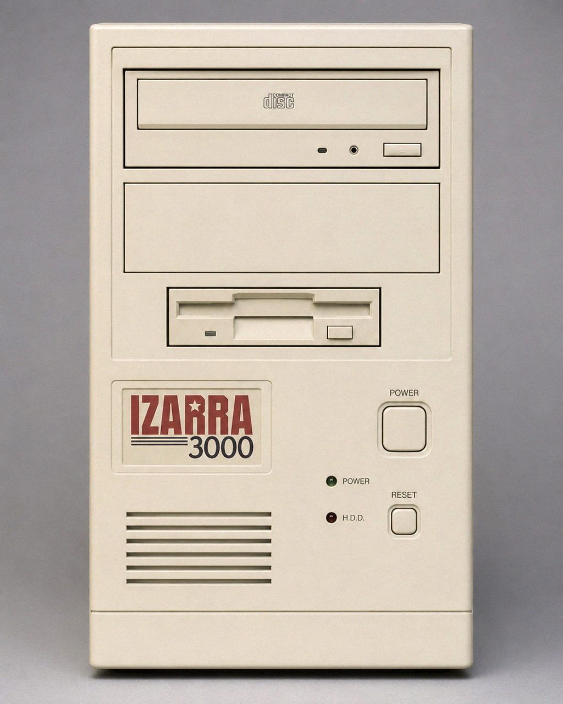
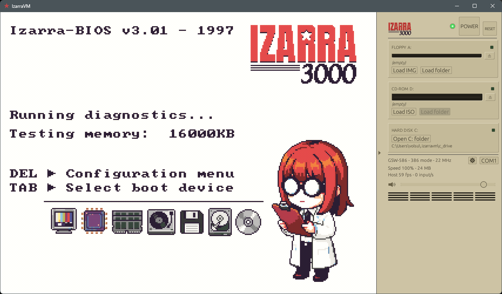

<!-- This file is part of IzarraVM and is licensed under GNU GPL version 3 only. -->
<!-- SPDX-License-Identifier: GPL-3.0-only -->

#  IzarraVM

IzarraVM is a Rust emulator for the Izarra 3000, a DOS-era workstation that
almost shipped in 1997. It models one fixed machine: custom video and audio
around an MS-DOS compatible core, booting Toka-DOS: a real FreeDOS-based
system running in virtual-8086 mode under the machine's own memory manager.

<p align="center">
  
  &nbsp;&nbsp;
  <a href="docs/izarravm-screenshot.png"></a>
</p>

The goal is to run early to mid 1990s DOS games as if the Izarra had reached
store shelves. It already runs a good deal of that era's software, and the work
is ongoing.

## Origin

Izarra started in Zamudio, Bizkaia, in 1982. Mikel Etxeberria handled the
hardware and repairs; Txema Goikoetxea handled customers, parts, and the less
glamorous business of getting invoices paid. Their first products were
electronic typewriters, backed by the sort of local service that meant a broken
machine did not have to be shipped away for weeks. Izarra also made parts for
Olivetti, steady work that helped keep the lights on.

By the late 1980s, those same customers were asking about PCs. Izarra moved into
custom workstations instead of simply rebadging AT compatibles, keeping familiar
DOS software but building its own hardware and operating-system stack around it.
That made the machines distinctive -- some Spanish magazines called Izarra
"the Basque Amiga" -- but it also made them expensive.

The computer line began with the 286-based Izarra 1000 in 1990, followed by the
386-based 2000 in 1992 and the 486-based 2700 in 1994. Each pushed a little
further beyond office work, especially as better graphics, sound, and CD-ROMs
made multimedia and home use more practical.

The Izarra 3000 was the big swing: a custom 586-class workstation with its own
BIOS, Toka-DOS 3.0, VEGA graphics, and ReSonique 2 sound. Unfortunately, it was
ready for a market that had already moved on. Buyers expected Windows 95, which
the machine could not run, and MS-DOS compatibility was no longer enough to
justify the cost of Izarra's custom approach. The 3000 never reached stores.
What survived were photos, manuals, BIOS dumps, unfinished developer notes, and
enough affection for the machine to give IzarraVM something worth preserving.

## Tech Specs

The emulator targets one fixed machine. None of this is user-selectable; it
reproduces the Izarra 3000 exactly as it was built.

| Area | Izarra 3000 hardware |
| --- | --- |
| CPU | GSW-586, a Pentium MMX class chip at 166 MHz on a 66 MHz bus. The BIOS or the bundled GSWMODE tool can throttle it to a 486DX2-like at 66 MHz, a 386DX-like at 22 MHz, or the same 386 ISA at 7.33 MHz without rebooting. |
| Memory | 64 MB PC100 SDRAM. |
| Graphics | VEGA chipset: Margo 2D with a 4 MB frame store; Distira 3D with a 2 MB framebuffer and 2 MB per TMU; VESA VBE 2.0, VGA mode 13h, and up to 1024x768 at 32-bit color. |
| Sound | ReSonique 2: Sound Blaster 16 compatible digital audio (PCM and Creative ADPCM), OPL3 FM, pin headers for a wavetable daughterboard, and a rear MPU-401/gameport. |
| Storage | 3.6 GB UDMA2 IDE hard disk on a PIIX4-compatible controller, 12x PIO ATAPI CD-ROM with CD audio, and a 1.44 MB floppy drive. |
| Display | 15-inch CRT, up to 1024x768@75hz. |
| Firmware | 2 MB ROM with the Izarra BIOS, Toka-DOS, and bundled tools. |
| I/O | PS/2 keyboard and mouse, serial, parallel, VGA, line out, line in, and MIDI/game port. |

## Current State

The emulator boots to a usable DOS with sound, mouse, CD-ROM (ISO, CUE/BIN, or
a host folder mounted as a disc), and floppy images. Legacy video personalities
(CGA, EGA, VGA, Hercules) are modeled down to the register level, and the
display goes through an optional, subtle CRT shader. Compatibility is already
fairly broad, and the work continues.

If a game you want to play does not run, or runs poorly where it should not,
please [open an issue](https://github.com/vorvek/IzarraVM/issues). The Izarra
3000 is a Pentium 200 MMX class machine, so anything that wanted more than that
in period still wants more than that here. Demanding 3D at high resolutions and
frame rates, or late titles that recommended a Pentium II or higher, are outside
what this hardware could ever have done rather than defects in emulation.

## Quick Start

```powershell
cargo run -p izarravm -- --headless-config-check
cargo run -p izarravm -- --headless-test-rom
cargo run -p izarravm -- --headless-boot-suite
cargo run -p izarravm -- --config examples/machine.toml
```

For non-Windows hosts later, replace the `c_drive` path in
`examples/machine.toml` or pass `--c-drive /path/to/dosroot`.

By default the C: drive, `cmos.bin`, and `izarravm.conf` live under the per-user
`~/.izarravm` directory, so launching the binary from any folder leaves nothing
behind in the working directory. Pass `--portable` to keep them in a `c_drive`
beside the executable instead, for a self-contained install.

## Optional MT-32 and Glide files

For convenience, IzarraVM can route the Izarra 3000's rear MPU-401 connection
through Munt. Munt needs one control ROM and its matching PCM ROM:

| Module | Control ROM | PCM ROM |
| --- | --- | --- |
| MT-32, old generation | `ctrl_mt32_1_04.rom`, `ctrl_mt32_1_05.rom`, `ctrl_mt32_1_06.rom`, or `ctrl_mt32_1_07.rom` | `pcm_mt32.rom` |
| MT-32, new generation | `ctrl_mt32_2_04.rom`, `ctrl_mt32_2_06.rom`, or `ctrl_mt32_2_07.rom` | `pcm_mt32.rom` |
| CM-32L | `ctrl_cm32l_1_00.rom` or `ctrl_cm32l_1_02.rom` | `pcm_cm32l.rom` |
| CM-32LN | `ctrl_cm32ln_1_00.rom` | `pcm_cm32l.rom` |

Settings accepts arbitrary control and PCM paths, so the archive filenames can
be selected directly. For automatic discovery, copy and rename an MT-32 pair
to `~/.izarravm/MT32_CONTROL.ROM` and `~/.izarravm/MT32_PCM.ROM`. Copy and
rename a CM-32L or CM-32LN pair to `~/.izarravm/CM32L_CONTROL.ROM` and
`~/.izarravm/CM32L_PCM.ROM`. Discovery is ASCII case-insensitive and is disabled
under `--portable`; paths selected in Settings still work. The source names in
the table match the `mt32pi` directory in the [Roland MT-32 ROMs
archive](https://archive.org/details/Roland-MT-32-ROMs).

Many DOS Glide games already include `GLIDE2X.OVL`; that game-local copy takes
priority. Otherwise, place a compatible Voodoo Graphics OVL at
`~/.izarravm/GLIDE2X.OVL`. IzarraVM finds the name without regard to ASCII case
and exposes it through `C:\DOS` as the global `PATH` fallback. A
[3DBVoodoo2 driver-disc image](https://archive.org/details/3-dbvoodoo-2_202302)
is archived for reference. IzarraVM does not bundle a replacement or
diagnostic OVL when neither copy is present.

IzarraVM neither downloads nor redistributes ROMs, Glide drivers, or game data.
Archive item metadata is not a license. Use these files only when you have the
lawful right to do so.

## Validation

```powershell
cargo fmt --check
cargo clippy --workspace --all-targets -- -D warnings
cargo test --workspace
cargo build --workspace
```

## License

GNU GPL version 3 only (`GPL-3.0-only`; see [LICENSE](LICENSE)).
