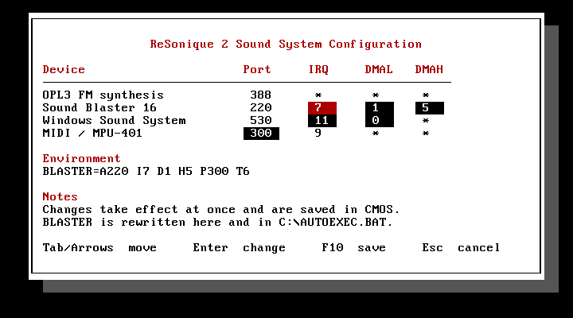

<!-- This file is part of IzarraVM and is licensed under GNU GPL version 3 only. -->
<!-- SPDX-License-Identifier: GPL-3.0-only -->

# ReSonique II Sound Card Manual

ReSonique II is the audio hardware of the Izarra3000. It is a combination card
with a Sound Blaster 16 compatible digital audio path and an OPL3 FM
synthesizer. This manual describes what a DOS program finds when it examines
the card.

## The parts of the card

| Section | Compatibility | Base port | IRQ | DMA |
| --- | --- | --- | --- | --- |
| Digital audio | Sound Blaster 16 / CT1745 mixer | `0x220` | 7 | 8-bit: 1, 16-bit: 5 |
| FM synthesis | OPL3 (Yamaha YMF262) | `0x388` | n/a | n/a |
| Codec | Windows Sound System (AD1848) | `0x530` | 11 | 0 |
| Wavetable daughterboard header | MPU-401 | `0x300` | 9 | n/a |
| Rear MIDI/game port | MPU-401 | `0x330` | 9 | n/a |

These are the power-on defaults. Toka-DOS puts the same values in `BLASTER`.
The base ports are fixed. The IRQ and the DMA are not fixed. See
[How to change the card resources](#how-to-change-the-card-resources) for the
tool that changes them.

The digital section and the FM section use the standard Sound Blaster and
AdLib addresses, which are fixed. ReSonique II gives a different fixed port to
the internal wavetable header and to the rear MIDI connection. Thus software
can select one path or the other directly. The rear 15-pin connector also
carries the usual joystick signals.

### Why the Sound Blaster uses IRQ 7

IRQ 5 is the factory setting of the Sound Blaster 16, thus you can expect IRQ
5 here. But ReSonique II uses IRQ 7, because DOS software is in two groups, and
only IRQ 7 is correct for both groups:

- A program that reads `BLASTER` operates on any line, because the variable
  always gives the current configuration.
- A program with a fixed IRQ in its code almost always uses 7. IRQ 7 was the
  factory setting of the Sound Blaster 1.x and the Sound Blaster 2.0, and the
  drivers were written for those cards. On IRQ 5, such a program receives no
  interrupt. With most drivers, the playback starts and then stops after the
  first DMA block. The result is a short click, and no more sound.

A fixed IRQ 5 is not frequent. IRQ 5 became a default only with the SB16-class
cards, and at that time a program usually read `BLASTER`. If a game needs IRQ
5, run `SNDCTRL` before you start the game.

The AD1848 codec cannot share a line with the Sound Blaster. Thus it uses IRQ
11, and not the WSS standard IRQ 7. A real combination card separates the two
lines with jumpers in the same way.

## The BLASTER variable

Toka-DOS sets this variable in `AUTOEXEC.BAT`. Thus a Sound Blaster program
finds the card without a probe:

```
SET BLASTER=A220 I7 D1 H5 P300 T6
```

The values are base address `0x220`, IRQ 7, 8-bit DMA channel 1, 16-bit DMA
channel 5, wavetable MPU port `0x300`, and card type 6 (Sound Blaster 16).
They agree with the defaults above.

Toka-DOS makes this line from the configuration of the machine. Thus the line
follows the values that you set. Toka-DOS does not change an `AUTOEXEC.BAT`
that you edited. In an edited file, `SNDCTRL` writes the `SET BLASTER` line
again in position, and does not change the remainder of the file.

## How to change the card resources

The `SNDCTRL` utility sets the hardware parameters of the ReSonique II sound
card. It is the setup utility of the card, and it is in `C:\DOS` on each
Toka-DOS disk. Run it from the DOS prompt:

```
C:\> SNDCTRL
```



The arrow keys and Tab move between the values. Press Enter on a value to
select from the list that the hardware supports. Press **F10** to apply the
changes. Esc keeps the previous values. A value that does not apply to a
device shows as `*`.

The lists show only the available values. A line or a channel that the other
device holds is not in the list. Thus you cannot give the same resource to the
Sound Blaster and to the codec. The emulator obeys the same rule at startup.

The apply operation does four things:

- The hardware changes immediately, and a restart is not necessary. SNDCTRL
  writes the Interrupt and DMA Setup registers of the mixer for the Sound
  Blaster, and the config register for the codec.
- SNDCTRL saves the values in CMOS. Thus the machine uses them again at the
  next boot.
- SNDCTRL changes `BLASTER` in the current environment. Thus a game that you
  start from the same prompt uses the new values.
- SNDCTRL writes the `SET BLASTER` line in `C:\AUTOEXEC.BAT` again. Thus the
  next boot uses the same values.

SNDCTRL changes an existing variable. It does not make a new one. If you
removed the `BLASTER` line, SNDCTRL reports this and does not put the line
back.

### From the command line

You can give each setting as a switch. `SNDCTRL` then applies the setting and
exits, and it draws nothing. This form is useful in a batch file:

```
SNDCTRL /SBIRQ:5              Sound Blaster IRQ        2, 5, 7, 10
SNDCTRL /SBDMAL:1             Sound Blaster 8-bit DMA  0, 1, 3
SNDCTRL /SBDMAH:5             Sound Blaster 16-bit DMA 5, 6, 7
SNDCTRL /WSSIRQ:11            Codec IRQ                7, 9, 10, 11
SNDCTRL /WSSDMA:0             Codec DMA                0, 1, 3
SNDCTRL /MPU:330              MPU-401 port             300, 330
SNDCTRL /S                    show the current assignment, change nothing
SNDCTRL /?                    usage
```

You can use more than one switch: `SNDCTRL /SBIRQ:5 /MPU:330`. If the hardware
cannot use a value, SNDCTRL refuses it and lists the values that the hardware
can use. If a combination would put both devices on one line or on one
channel, SNDCTRL refuses the combination and writes nothing.

`SNDCTRL /S` reads the Sound Blaster mixer. Thus it gives the current values of
that device, even after a different program changed them.

The codec cannot be read this way. A Windows Sound System board answers its
configuration register with an identification value, not with the line and the
channel that were written into it, so no program can ask the card what routing
it has. For the codec, `SNDCTRL` reports the saved assignment, the same way it
reports the MPU-401 port. A game that moves the codec for its own run does not
appear here.

### Why the machine config file has nothing to set

The file had these keys before. `[audio.sound_blaster] irq` and the related
keys are now removed. The machine boots from CMOS. Thus, after `SNDCTRL` saved
an assignment, a change to those keys had no effect on the machine.

An old config file continues to load. IzarraVM ignores the removed keys, and
writes their names in the log.

The file keeps the settings that CMOS does not hold. These are `enabled`,
which says if the device is fitted, and `base`, which is the I/O base of the
codec. The base is fixed wiring on the board, and not a selectable resource.

`--sb-irq`, `--sb-dma`, and `--sb-high-dma` continue to operate on the command
line. They set the power-on values for a machine with no saved CMOS. Each
headless run is such a machine, because a headless run does not load CMOS. On
a configured machine, the saved assignment has priority, and the emulator
reports this:

```
WARN the saved CMOS overrode these flags; it is what the machine boots from.
Change the CPU speed with GSWMODE or the BIOS setup panel (Del), and the sound
card with SNDCTRL, both inside DOS -- or delete cmos.bin to start from the
flags again  flags=--sb-irq 5
```

`--cpu` behaves in the same way, for the same reason.

## How to set the volume

Use the `SNDMIXER` utility to set the volume levels of the card. It shows
seven vertical faders for the mixer of the card: MASTER, FMSYNTH, WAVE,
CD-ROM, MIDI, the PC speaker, and AMP. SNDMIXER applies each level as you move
the fader. It saves the levels to a file, and `AUTOEXEC.BAT` sets them again
at the next boot.

```
C:\> SNDMIXER
```

Tab and the arrow keys move between the faders. After the faders, they move to
the **Accept** button and the **Cancel** button at the bottom of the box.
Enter or Space operates the selected button. Accept exits and keeps the new
levels. Cancel sets the levels that were in effect when the mixer opened. F10
saves the levels for the next boot.

There is no line-in fader and no microphone fader. The machine emulates
playback only. Thus those inputs have no signal, and a control has nothing to
change.

Each leg of the card starts at 0 dB, and the mix keeps its headroom after the
mixer. Thus nothing clips at the default settings, and the faders cover the
full range below the default. Each step is 4 dB. This puts the ten positions
at equal distances, and not in the top part of a 62 dB scale. The full switch
list is in [SNDMIXER](../toka-dos/commands.md#sndmixer).

Two of the seven faders are not standard Sound Blaster registers:

- **PC speaker** is the PC-SPK input of the card (mixer register `0x3B`). On
  the real chip, that input is two bits wide. Thus the fader has four
  positions, and not ten. The card mixes the beeper, and MASTER thus changes
  its level also.
- **MIDI** is the wavetable synthesizer. A real SB16 has no register for a
  wavetable. Its "MIDI" volume is the FM bus, which is the FMSYNTH fader on
  this card. Thus the ReSonique II adds two registers of its own, at `0x50` and
  `0x51`. They are in the same register file, and on the same 5-bit scale as
  the others.

  Only this pair has a mute bit, in D0. On this pair, a level of zero is the
  quietest audible step, and not silence. The wavetable is the only source
  with no second control in the machine. Without this behavior, a program that
  cleared the mixer registers would make the wavetable silent, with no cause
  on the screen. Use the mute bit to mute the wavetable.

### Output gain (AMP)

The seventh fader is not a volume control. It is the output amplifier of the
card. It is the only control on the card that adds level.

The amplifier is on the internal bus of the card, beside the master. It
increases the level of the FM synthesis, of the digital audio from the Sound
Blaster DSP, and of the PC-speaker input. The CD audio and the Windows Sound
System codec do not go through it. Those two legs reach the summing node with
their own attenuation only. Thus the AMP fader does not increase the level of
a Red Book track or of a WSS recording.

| Register | Bits | Field | Positions |
| --- | --- | --- | --- |
| `0x41` | D7-D6 | Output gain, left | 0, 1, 2, 3 |
| `0x42` | D7-D6 | Output gain, right | 0, 1, 2, 3 |

Each position is 6 dB:

| Position | Gain | Fader step |
| --- | --- | --- |
| 0 | 0 dB | 0 |
| 1 | +6 dB | 3 |
| 2 | +12 dB | 7 |
| 3 | +18 dB | 10 |

Position 0 is the power-on setting. It is the bottom of the fader travel, and
it is not a mute. An amplifier at 0 dB sends its input through with no change,
and each position above 0 adds gain. `SNDMIXER` writes the two registers
together, from one fader. A difference between them is a change of balance,
and not a change of level.

**Warning: the gain can clip the signal.** The mix keeps 6 dB of headroom at
the point where the card sums its legs. That is sufficient for one leg at full
scale. The amplifier operates on its three legs before that sum. Thus position
1 uses the full reserve. Positions 2 and 3 are more than the reserve, and a
loud source will distort. Two examples of a loud source are a DSP voice at
full scale, and the FM and the voice together.

The card gives these positions, and the fader gives them. Neither one refuses
the setting, and neither one decreases the level automatically. Use the
positions to make a quiet game louder, and not to make a loud game louder.

## Digital audio (Sound Blaster 16 compatible)

The CT1745-compatible mixer and the DSP answer at `0x220` to `0x22F`. They use
the power-on IRQ and DMA in the table above. You can move both from inside DOS
with [`SNDCTRL`](#how-to-change-the-card-resources), for a program that needs
different values. The `BLASTER` line of Toka-DOS always agrees with the
current configuration.

The guest can write the Interrupt and DMA Setup registers of the mixer
(`0x80` and `0x81`). Thus a program that configures the card in that way also
moves it. It uses the same path as `SNDCTRL`.

## FM synthesis (OPL3)

The FM synthesizer is at `0x388`, the standard AdLib, OPL2, and OPL3 address.
It answers as a real OPL3 (Yamaha YMF262). It has the full four-operator
instrument set, and the two-operator patches of the OPL2. Software detects it
as it detects real OPL3 hardware: it reads back the status register and the
timer registers. This is the classic AdLib detection routine.

## Creative ADPCM

The DSP decodes Creative ADPCM as a real SB16 does. The decoder is part of the
digital audio path, and not a separate device. The playback commands are the
4-bit, 2.6-bit, and 2-bit commands: `0x74` to `0x77`, `0x16`, `0x17`, and
their auto-init forms. They expand the compressed DMA stream to 8-bit samples,
through the adaptive predictor of the DSP. The DSP raises one interrupt at
each programmed block boundary, as it does in raw PCM playback. A program that
sends the ADPCM DSP commands needs no other detection and no other
configuration.

## MIDI and wavetable

The card has two MPU-401 port pairs. A game that is configured for a wavetable
daughterboard sends its music to `0x300`. Toka-DOS gives this port as `P300`
in `BLASTER`. This path goes to the daughterboard pin headers in the case. A
game that is configured for an external MPU-401 sends its music to `0x330`,
which goes to the rear MIDI/game connector. A breakout cable gives the
standard MIDI sockets.

Both ports supply UART output and the playback part of the MPU-401 intelligent
mode. Software in intelligent mode can use eight timed tracks, the conductor,
changes of tempo and timebase, and the start and the stop of playback. The two
ports share IRQ 9 for the acknowledgements and the data requests. Neither
interface supplies recording, external clock sync, metronome input, or MPU
reference filters.

IzarraVM supplies the daughterboard and the external receiver separately. The
[GUI guide](../izarravm-gui/guide.md#the-config-modal) describes those host
settings and their status messages. The [recipes](../recipes/index.md) give
the procedures that use them.

## Next

- [How to use Toka-DOS](../toka-dos/using-toka-dos.md): where `SET BLASTER` is
  set, and what else `AUTOEXEC.BAT` does.
- [Troubleshooting](../troubleshooting.md): audio setup problems and their
  solutions.
